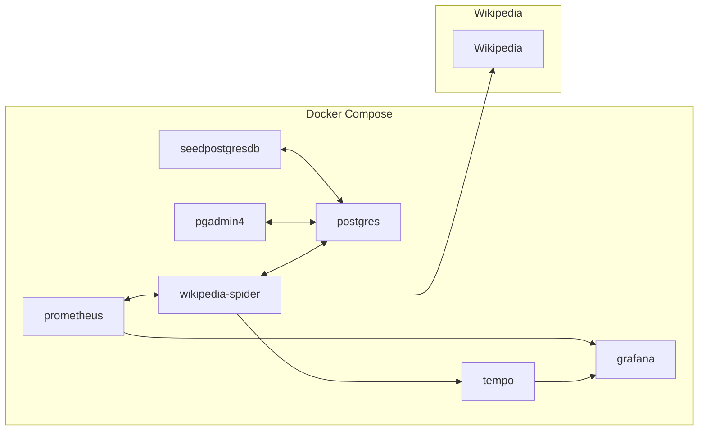

<h1 align="center">
  wikipedia-spider
</h1>
<h2 align="center">
  a demonstration crawler that starts at a specific wikipedia article and crawls outward to a specified depth. it adds all links found to postgres db.
</h2>

[Wikipedia][wikipedia-link]

[![Made With Go][made-with-go-badge]][for-the-badge-link]

---
## Flowchart

## Development
### Prerequisites
* Please run `make setup` to install commitlint

### Building
* Docker Compose should work right-out-of-the-box!
  * Just run `docker compose up --build -d`

Applications with frontends:
* Grafana: [localhost:3000](http://localhost:3000)
* PgAdmin4: [localhost:8082](http://localhost:8082)

<!--

Reference Variables

-->

<!-- Badges -->
[made-with-go-badge]: .github/images/made-with-go.svg

<!-- Links -->
[blank-reference-link]: #
[wikipedia-link]: https://en.wikipedia.org
[for-the-badge-link]: https://forthebadge.com